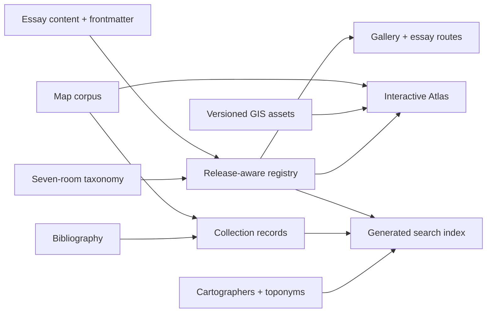

# Terra Chartarum site handbook

This is the operating guide for Terra Chartarum: what the publication is, how a
reader gets the most from it, how its content and data fit together, how to run
and extend it, and what should be built next.

**Last verified:** 5 August 2026, against the repository and production-gated
static build. When this handbook disagrees with generated output, the content
schema and release gate are authoritative.

## Contents

1. [The site in one minute](#the-site-in-one-minute)
2. [How to use the site](#how-to-use-the-site)
3. [A guide to every public area](#a-guide-to-every-public-area)
4. [Search and discovery](#search-and-discovery)
5. [Using the Atlas](#using-the-atlas)
6. [Reading, researching, and citing](#reading-researching-and-citing)
7. [Editorial model](#editorial-model)
8. [Technical architecture](#technical-architecture)
9. [Content and data sources](#content-and-data-sources)
10. [Local development](#local-development)
11. [Adding and releasing an essay](#adding-and-releasing-an-essay)
12. [Adding maps, people, sources, and GIS layers](#adding-maps-people-sources-and-gis-layers)
13. [Quality, accessibility, privacy, and performance](#quality-accessibility-privacy-and-performance)
14. [Deployment and recovery](#deployment-and-recovery)
15. [Maintenance routines](#maintenance-routines)
16. [What to add next](#what-to-add-next)
17. [Drift prevention](#drift-prevention)
18. [Existing specialist documentation](#existing-specialist-documentation)

## The site in one minute

Terra Chartarum is an interactive historical atlas and a publication of visual
essays about the history and politics of mapmaking. Its governing proposition is
that every map is an argument: choices about measurement, naming, projection,
scale, borders, and omission are choices about power.

The site works at four connected scales:

- **Essays** make long-form interpretive arguments.
- **Rooms** organise those arguments into a seven-part cosmography.
- **The Atlas** puts maps, essays, places, time, and historical GIS layers into
  one spatial interface.
- **The Collection** turns individual maps, cartographers, sources, and
  reproductions into researchable records.

The seven rooms are:

| Room        | Central question                                                 |
| ----------- | ---------------------------------------------------------------- |
| The Earth   | What exists before the map simplifies it?                        |
| The Map     | How do projection, scale, survey, and symbol make an argument?   |
| The City    | How does lived space become property, address, and jurisdiction? |
| The Border  | How do lines claim, divide, include, and erase?                  |
| The Road    | How does the world look when experienced as movement and route?  |
| The Archive | What do old maps preserve, omit, and reveal as artefacts?        |
| The Theatre | How does mapping stage knowledge and make abstraction visible?   |

### Current production-gated inventory

Counts, held essays, per-room depth, and the geo release are generated from the
same registries and release gate as the site. Read the
[generated corpus status](generated/corpus-status.md) rather than copying totals
into another document.

There are additional essay files in the repository that carry
`releaseAt: '2099-01-01'`. They are intentionally held from normal builds. Use
the unreleased authoring mode described below to inspect them; do not infer that
a file is public merely because it exists under `src/content/essays/`.

## How to use the site

There is no single correct path. The strongest route depends on what the reader
wants from the publication.

### First-time visitor

1. Start at **About** to understand the claim that maps are arguments rather
   than neutral windows.
2. Open **Rooms** and choose the question that interests you most.
3. Read that room's anchor essay.
4. Follow its room path or related material rather than returning immediately to
   the home page.
5. Open the **Atlas** after reading one essay, when its pins, regions, layers,
   and time range have interpretive context.

This route makes the site's conceptual structure clear before presenting its
largest data interface.

### Reader following a subject

Use global search with `Cmd-K` on macOS or `Ctrl-K` elsewhere. Search accepts
essay titles, map titles, cartographers, regions, tags, summaries, and historical
place-names. Narrow results by type, room, region, era, or tag.

If the subject is broad, start with a room. If it is a named map or mapmaker,
start with the Collection or Cartographers. If it is a place with several
historical names, use global search and follow the place result into the Atlas.

### Researcher investigating one map

1. Search for the map in **Collection** or global search.
2. Open its record for date, region, maker, physical metadata, provenance,
   imagery, tags, related maps, and bibliography, where present.
3. Use **View on the atlas** to understand its spatial and chronological
   position.
4. Follow the source essay to see the map used in an argument.
5. Export its citation as BibTeX, RIS, or Chicago text.
6. Follow bibliography back-links to see which other records use the same work.

Treat sparse fields as unknown, not as evidence that a property does not exist.
The catalogue schema deliberately allows incomplete records while the collection
is enriched.

### Teacher or seminar leader

A reliable session structure is:

1. Read the manifesto's **Every map is an argument** section.
2. Choose one room and one anchor essay.
3. Ask students to identify the maker, method, motive, audience, and silence of
   one map.
4. Use the Atlas time control to compare what becomes visible at different
   dates.
5. Use the cross-essay meta-lens to compare two arguments.
6. Finish in the Colophon, where the limits of that comparison are made
   explicit.

The meta-lens should prompt discussion, not be treated as a quantitative ranking
of essay quality or historical importance.

### Editor or contributor

Read this handbook, then use the focused sequence:

1. [`CONTRIBUTING.md`](../CONTRIBUTING.md)
2. [`starter/README.md`](../starter/README.md)
3. [Editorial style guide](editorial/style-guide.md)
4. [Essay definition of done](essay-definition-of-done.md)
5. [Component library](component-library.md)
6. [Design tokens](design-tokens.md)
7. [Launch runbook](launch-runbook.md)

Run the site with `SHOW_UNRELEASED=1` while working on held essays. A normal
development or production build correctly hides them.

### GIS or digital-humanities researcher

Start in the Atlas, enable one historical layer at a time, and move the year
control through its active interval. Use layer documentation and source links
before interpreting a feature. For reuse or interoperability, consult the
[geo-layer guide](geo-layers.md), [interoperability guide](geo-interoperability.md),
and [VMN data documentation](vmn/README.md).

## A guide to every public area

| Route                     | Purpose                                                                             | Best use                                              |
| ------------------------- | ----------------------------------------------------------------------------------- | ----------------------------------------------------- |
| `/`                       | Concise front door with featured essays and corpus totals                           | Start quickly or return to featured work              |
| `/about/`                 | Manifesto and explanation of the seven rooms                                        | Understand the editorial position before reading      |
| `/rooms/`                 | Seven-room overview with counts for essays, sheets, and layers                      | Browse by a conceptual question                       |
| `/rooms/<slug>/`          | Room lede, anchor, essays, passing chapters, layers, sheets, adjacent rooms         | Follow a curated thematic path                        |
| `/essays/`                | Room-grouped essay gallery with title, era, region, and meta-lens filters           | Browse the long-form corpus                           |
| `/essays/<slug>/`         | Native MDX essay or isolated legacy essay, plus room context                        | Read and continue through related material            |
| `/atlas/`                 | MapLibre corpus map, time control, GIS layers, meta-lens comparison, essay timeline | Explore relationships in space, time, and argument    |
| `/collection/`            | Filterable catalogue of individual maps                                             | Research a specific object or build a comparison set  |
| `/collection/<id>/`       | Map image, metadata, related records, sources, and citation export                  | Inspect and cite a map                                |
| `/cartographers/`         | Registry of mapmakers                                                               | Browse makers rather than objects                     |
| `/cartographers/<id>/`    | Biographical profile and linked collection records                                  | Trace a maker through the corpus                      |
| `/bibliography/`          | Deduplicated source list with map back-links                                        | Audit sources and follow shared scholarship           |
| `/colophon/`              | Methodology, six meta-lens dimensions, full crosswalk, design language              | Understand how cross-essay comparison is constructed  |
| `/series/invisible-maps/` | Series page for spatial systems that are not ordinary sheets                        | Read recurring arguments across rooms                 |
| `/embeds/vmn-network/`    | Standalone Venetian route and commodity network                                     | Explore routes, waypoints, and commodities as a graph |
| `/privacy/`               | Analytics and data-handling disclosure                                              | Review the site's privacy posture                     |
| `/rss.xml`                | Published essay feed                                                                | Follow new releases in a feed reader                  |
| `/search-index.json`      | Generated public search index                                                       | Power client search or inspect indexed records        |
| `/geo/toponyms.geojson`   | Gazetteer-style place export                                                        | Reuse toponyms as GeoJSON                             |
| `/geo/toponyms.lpf.json`  | Linked Places Format export                                                         | Interoperate with Linked Pasts tools                  |

### Home

The home page is intentionally short. Its two primary actions are **Enter the
gallery** and **Open the atlas**. Use the gallery when you want an authored
reading experience. Use the Atlas when you already have a period, region, map,
or essay in mind.

### Rooms

Rooms are the best editorial navigation. Each room page can contain:

- a defining anchor essay;
- primary essays assigned to the room;
- secondary essays that pass through it;
- deep-linked chapters from essays whose primary home is elsewhere;
- related historical GIS layers;
- related collection sheets; and
- previous/next room navigation.

A room is therefore more than a category. It is a curated reading sequence that
can mix long-form arguments, object records, and spatial data.

### Essays

The gallery groups essays by canonical room. The local search is title-focused;
its filters cover era, region, and shared meta-lens. Use global search instead
when looking for a cartographer, place-name, tag, or map record.

Essay pages have two rendering modes:

- **Native essays** are authored in MDX and render within the portal. They can
  use the shared interactive island library and render their meta-lens panel at
  the end.
- **Legacy essays** are preserved self-contained documents. They render inside a
  same-origin iframe so their CSS and JavaScript cannot collide with the portal.

Both modes keep the shared essay bar, previous/next links, room membership, room
path, and related content. Section hashes aimed at a legacy essay are forwarded
into its iframe.

### Collection

The catalogue supports text search and facets for century, region, source essay,
cartographer, tag, and depicted coverage. The **Covers** facet is spatial rather
than bibliographic: it asks whether a map lies within another authored map
footprint.

A record may contain a static reproduction or a high-resolution IIIF/Deep Zoom
viewer. Image credit and licence belong with the reproduction. The catalogue
record also provides the stable public URL used by its citation exporter.

### Cartographers and bibliography

Cartographer profiles make the maker a navigable entity instead of repeating a
name as free text. The bibliography deduplicates shared works and links each work
back to the collection records that cite it. Together, these registries let a
reader move along `maker -> map -> essay -> source` or in the reverse direction.

## Search and discovery

### Global search

Open global search using the header button or `Cmd-K` / `Ctrl-K`. It lazily loads
both Fuse.js and the generated index, so the search code is not part of the
initial page payload.

The index includes:

- published essays;
- collection maps;
- cartographers; and
- modern, ancient, medieval, and variant place-names.

Available facets are type, room, region, era, and tag. The interface displays up
to 40 results while reporting the full result count.

Good search patterns include:

- a modern or historical place-name, such as a port variant;
- a cartographer surname;
- a map title fragment;
- a region followed by a room facet;
- a concept expressed as a tag; or
- a broad query narrowed to only maps or essays.

### Local filters

Three pages provide more specialised filtering:

- **Essays:** fuzzy title search, era, region, and meta-lens.
- **Collection:** title/region/cartographer text plus century, region, essay,
  cartographer, tag, and spatial coverage facets.
- **Bibliography:** author, title, year, or citation text.

Filters are client-side and operate over the current static page. Reset them
before concluding that the publication contains no matching material.

### Deep links

Stable deep links are part of the site's research value:

- essay sections use `/essays/<slug>/#<section-id>`;
- collection pins use `/atlas/#<map-id>`;
- toponyms use `/atlas/#topo-<id>`;
- Atlas state can carry `essay`, `year`, VMN layer IDs, a port, a route, or a
  territory in its query string.

When authoring, preserve published slugs and section IDs. A renamed anchor can
break room chapters, GIS reverse links, external citations, and saved Atlas URLs.

## Using the Atlas

The Atlas is a set of coordinated views rather than a single map. It combines:

1. a geolocated map corpus;
2. a reveal-through-year control;
3. essay and region filters;
4. depicted-coverage filtering;
5. historical and variant place-names;
6. time-aware historical GIS layers;
7. a context panel that follows the current selection;
8. a cross-essay meta-lens comparison; and
9. an ancient-compressed essay timeline.

### Recommended workflow

1. Select an essay first. This narrows the map to the objects used by one
   argument and synchronises the essay timeline.
2. Move **Reveal through** slowly. Earlier maps remain conceptually distinct
   from later maps even when the compressed timeline puts them close together.
3. Select a pin and read the context panel.
4. Enable at most one or two historical GIS layers initially.
5. Use layer-specific region filters when available.
6. Follow **Read passage** links to see why a layer matters to an essay.
7. Clear the essay filter only after you understand one strand of the corpus.

### Controls

| Control                        | Effect                                                            |
| ------------------------------ | ----------------------------------------------------------------- |
| Corpus search                  | Matches map, region, and essay text in the Atlas payload          |
| Essay filter                   | Shows one essay's maps and aligns the context/timeline state      |
| Port region                    | Narrows Venetian ports after the relevant layer is enabled        |
| Depicted within                | Limits maps to an authored map-coverage footprint                 |
| Reveal through                 | Applies the selected upper year across maps and time-aware layers |
| Ancient & medieval place-names | Adds toponym pins and variant-name context                        |
| Historical GIS checkboxes      | Adds available vector layers; pending layers remain disabled      |

The map is progressively enhanced. Without JavaScript or WebGL, readers still
receive the full corpus as a chronological list.

### Historical GIS interpretation

Every published layer has source, licence, attribution, format, geometry type,
time extent, feature count, checksum, and versioned URL in the geo manifest.
Features with temporal ranges obey the Atlas year state. The Venetian Maritime
Network provides ports, routes, and phased territorial possessions as
FlatGeobuf.

The year control is an interpretive filter, not a claim that every source has
year-level precision. Read layer notes and provenance before treating an edge
date as exact.

### Meta-lens comparison

The Atlas can compare two essays over Measure, Witness, Use, Cosmos, Power, and
Silence. Switch to **Native lenses** to see the original terms mapped into those
dimensions. The normalised values are editorial discovery aids. They do not
erase the conceptual differences between each essay's vocabulary.

## Reading, researching, and citing

### Read an essay as an argument

For each map, ask:

- Who made or commissioned it?
- For whom was it useful?
- What did its method make measurable?
- What did that method make hard to see?
- Which names, borders, scales, or projections appear natural only because the
  map presents them confidently?
- How does the interactive component demonstrate the argument rather than merely
  decorate it?

### Follow the evidence chain

The intended research chain is:

```text
room or search result
  -> essay argument
  -> individual map record
  -> cartographer and related maps
  -> bibliography and source record
  -> Atlas position or historical layer
```

Not every record is equally complete. Prefer records with explicit reproduction
credit, licence, bibliography, provenance, and a high-resolution source.

### Cite a map, essay, or dataset

On a collection or essay detail page, open its citation panel, choose BibTeX,
RIS, or Chicago, then use **Copy**. The Atlas provides equivalent versioned
citations for every published GIS asset under **Cite the Atlas data**. Review the
result before publication, especially when a record has no named maker or date.

### Cite data

For GIS data, cite the human-readable source log and the released asset version.
The versioned URL and SHA-256 checksum in `public/geo/manifest.json` identify the
exact binary. VMN features carry source keys that resolve into
`data/vmn/sources.csv`.

## Editorial model

### Voice

The editorial voice is academic but intimate, precise without pretending to be
neutral, and written in British English. An essay should make a claim about what
a map does. A sequence of attractive maps without an argument is a gallery, not
a Terra Chartarum essay.

The recurring critical pattern is:

```text
cartographic gain -> practical or political use -> resulting silence
```

For example, a more exact parcel survey can make taxation and exchange easier
while suppressing negotiated or communal uses of the same ground.

### Seven-room taxonomy

Every essay has one required primary room and up to two secondary rooms.
Sections can carry their own room membership, allowing a chapter to appear in a
different room without changing the essay's primary home. Collection maps,
cartographers, and GIS layers can also carry room membership.

`src/data/rooms.ts` is the single source of truth for room slugs, titles, order,
blurbs, ledes, and glyphs. Do not duplicate the taxonomy in a component or
content script.

### Meta-lens

Each essay keeps its native lenses. Optional `metaScores` add a comparable layer
over six canonical dimensions. The mapping is additive, documented in the
Colophon, and intentionally exposes its limitations.

### Native and legacy material

Prefer native MDX for new work. Legacy mode exists to preserve already complete,
self-contained HTML documents without risky refactoring. Do not use the iframe
boundary as the default architecture for new essays.

### Release state

Rendering mode and publication state are separate:

- `status: native | legacy` chooses how an essay renders.
- `releaseAt: YYYY-MM-DD` determines whether normal builds include it.

New essays are scaffolded with `releaseAt: '2099-01-01'`. A normal build excludes
them from essay routes, galleries, feeds, search, room pages, and links that use
the release-aware registry. `SHOW_UNRELEASED=1` is for local authoring only.

## Technical architecture

### Core choices

- Astro 4 with static output.
- TypeScript in strict mode.
- Astro Content Collections with Zod validation.
- Tailwind plus a CSS custom-property design-token layer.
- HTML-first Astro islands with vanilla JavaScript where interaction requires
  it.
- MapLibre for the interactive Atlas, loaded lazily.
- FlatGeobuf and GeoJSON for historical GIS assets.
- Fuse.js for lazy client-side fuzzy search.
- OpenSeadragon for IIIF/Deep Zoom imagery.
- Vitest, Playwright, axe, and Lighthouse CI for verification.

### System flow



### Static output

`npm run build` writes a portable `dist/`. There is no application server,
database, account system, or runtime API. Astro endpoints such as the search
index, RSS feed, and toponym exports are generated as static files at build time.

This makes the site inexpensive, portable, cacheable, and privacy-friendly. It
also means a content release, analytics change, or data correction requires a
new build and deployment.

### Route and asset separation

The public essay route `/essays/<slug>/` must never share a filesystem output
path with a raw legacy document. Legacy documents belong under
`public/embed/<slug>/` and are loaded by the wrapper route. Moving one to
`public/essays/<slug>/` would make the wrapper load itself recursively.

### Repository map

| Path                             | Responsibility                                                           |
| -------------------------------- | ------------------------------------------------------------------------ |
| `src/pages/`                     | Static routes and generated data endpoints                               |
| `src/layouts/PortalLayout.astro` | Shared document shell, metadata, fonts, focus management                 |
| `src/components/`                | Shared chrome and editorial components                                   |
| `src/components/islands/`        | Interactive components with progressive enhancement                      |
| `src/content/essays/`            | Native MDX and legacy wrapper records                                    |
| `src/content/config.ts`          | Essay frontmatter schema                                                 |
| `src/data/rooms.ts`              | Canonical seven-room taxonomy                                            |
| `src/lib/`                       | Registries, schemas, formatters, search projections, geo and VMN helpers |
| `src/styles/`                    | Global CSS and design tokens                                             |
| `public/embed/`                  | Preserved legacy essay documents                                         |
| `public/geo/`                    | Published, browser-served GIS assets and release manifest                |
| `data/geo/`                      | Authored geo catalogue metadata                                          |
| `data/vmn/`                      | VMN source authority tables and authored geometry                        |
| `data/editorial/`                | Editorial manifests, policies, and wave backlogs                         |
| `docs/editorial/`                | Briefs, research, outlines, and review notes                             |
| `scripts/`                       | Scaffolding, release, image, editorial, indexing, and geo pipelines      |
| `e2e/`                           | Cross-browser flows, accessibility, and smoke coverage                   |
| `starter/`                       | Native essay template and component examples                             |

## Content and data sources

### Essay source of truth

Essay frontmatter and body live in `src/content/essays/`. The schema requires:

- title, subtitle, and summary;
- cover and optional hero image;
- rendering status and optional legacy embed path;
- eras, regions, and native lenses;
- year range;
- order and featured state;
- one primary room and up to two secondary rooms;
- optional section-level room links;
- publication and update dates;
- required release date; and
- optional normalised meta-lens scores.

### Collection source of truth

Individual historical maps currently live as validated authored records in
`src/lib/corpus.ts`. Core Atlas fields are required; richer catalogue fields are
optional. The client-side Atlas receives only the small core projection so
bibliography and detailed metadata do not inflate every Atlas visit.

### Registry sources

- Cartographers: `src/lib/cartographers.ts`
- Bibliography: `src/lib/bibliography.ts`
- Toponyms: `src/lib/toponyms.ts`
- Rooms: `src/data/rooms.ts`
- GIS layer presentation: `src/lib/geo.ts`
- GIS publication contract: `data/geo/catalog.json`

These code-backed registries are type-safe and easy to build statically, but
large editorial updates require code review. If the corpus grows substantially,
moving them to validated JSON, CSV, or content collections would make editorial
ownership clearer without changing the public routes.

### Published geo source of truth

`data/geo/catalog.json` declares publishable assets. `public/geo/manifest.json`
is generated from the declared metadata and the actual files. The manifest adds
byte size, SHA-256, version, and cache-safe URL.

For VMN, editable CSV and geometry inputs live in `data/vmn/`; compiled
FlatGeobuf files under `public/geo/` are deterministic publication artifacts.

## Local development

### Prerequisites

- Node 20, matching `.node-version`.
- npm.
- Python only when rebuilding or validating the VMN dataset locally.

### First setup

```sh
npm ci
npm run dev
```

Open `http://localhost:4321`.

Use `npm install` when intentionally changing dependencies. Use `npm ci` for a
reproducible install from the lockfile.

If the global npm cache is unavailable:

```sh
npm install --cache ./.npm-cache --no-audit --no-fund
```

### Common commands

| Command                         | Purpose                                                                                          |
| ------------------------------- | ------------------------------------------------------------------------------------------------ |
| `npm run dev`                   | Run the local Astro server                                                                       |
| `SHOW_UNRELEASED=1 npm run dev` | Include held essays locally                                                                      |
| `npm run build`                 | Run editorial, typography, release, indexing, and geo-interoperability gates, then build `dist/` |
| `npm run preview`               | Serve the built static output                                                                    |
| `npm run check`                 | Validate Astro, TypeScript, and content schema                                                   |
| `npm run lint`                  | Run ESLint                                                                                       |
| `npm run test`                  | Run Vitest unit tests                                                                            |
| `npm run test:e2e`              | Build, preview, and run Playwright across desktop/mobile engines                                 |
| `npm run format:check`          | Check Prettier formatting                                                                        |
| `npm run format`                | Apply Prettier formatting                                                                        |
| `npm run geo:validate`          | Verify geo catalogue, files, checksums, and manifest                                             |
| `npm run reports:write`         | Rebuild generated corpus and collection-completeness reports                                     |
| `npm run reports:check`         | Fail when generated publication reports do not match the current build                           |
| `make vmn-validate`             | Validate compiled VMN schema, geometry, time, provenance, joins, and coastlines                  |

### Before opening a pull request

Run:

```sh
npm run format:check
npm run lint
npm run check
npm run test
npm run geo:validate
npm run build
npm run test:e2e
```

Playwright builds the real production output before testing it. A passing dev
server is not a substitute for a passing static build.

## Adding and releasing an essay

### 1. Begin with a proposal

Define the argument, primary and secondary rooms, corpus and rights status,
interactive spine, year range, regions, lenses, and roadmap fit. Resolve image
rights and scan quality early; they are expensive blockers late in production.

### 2. Scaffold

```sh
npm run create-essay -- --slug my-essay --title "My Essay Title"
```

This creates:

- `src/content/essays/my-essay.mdx`; and
- `public/covers/my-essay.svg`.

The script refuses to overwrite an existing essay and validates a lowercase,
hyphenated slug.

### 3. Complete frontmatter

Set accurate metadata, including a canonical room and release date. New essays
remain held by default. Negative years represent BC. `publishedAt` is the
editorial date of record; `updatedAt` records revision; `releaseAt` controls the
build gate.

### 4. Build the editorial package

For a fully tracked essay, the editorial manifest advances through:

```text
concept -> corpus -> research -> outline -> draft -> build -> design-qa -> publish
```

The validators progressively require a substantive thesis, a rights-checked
corpus, bibliography and claims ledger, mapped outline, reviewed draft, cover,
social image, and publish cross-links.

### 5. Write with shared components

Import only the islands the argument requires. Existing patterns include radar,
adaptive timeline, comparison slider, scrollytelling, plate-state exploration,
deep zoom, cartometry, city memory, sacred orientation, route networks, and
other essay-specific components.

Use a new island only when the existing library cannot express the argument.
Keep the default server-rendered and add JavaScript only for behaviour that
cannot be expressed in accessible HTML/CSS.

### 6. Integrate

Verify that the essay appears correctly in:

- its route;
- the room-grouped gallery;
- its primary and secondary room pages;
- room chapter deep links;
- the Atlas essay filter and timeline;
- global search;
- RSS after release; and
- related room paths and series, when applicable.

### 7. Review

Complete editorial, design, accessibility, performance, source, metadata, and
cross-link review. Use the full [definition of done](essay-definition-of-done.md)
and pull-request checklist.

### 8. Release

Release today:

```sh
npm run essay:release my-essay
```

Schedule a date:

```sh
npm run essay:release my-essay --on 2026-09-15
```

The command changes `releaseAt` and lists material still held. Commit and push
the change. Because the site is static, the essay becomes public only after the
next successful deployment.

### Legacy essays

For a preserved self-contained document:

1. Place it under `public/embed/<slug>/`.
2. Add a content record with `status: legacy`.
3. Point `embedPath` to `/embed/<slug>/index.html`.
4. Confirm section IDs used by room pages exist inside the document.
5. Test the iframe interior separately; portal axe tests intentionally exclude
   legacy iframe contents.

Do not reformat or refactor preserved legacy documents casually. The iframe is
an archival isolation boundary.

## Adding maps, people, sources, and GIS layers

### Add or enrich a map

Edit the validated corpus record in `src/lib/corpus.ts`. At minimum, preserve a
stable ID, title, year, source essay, region, and `[longitude, latitude]` pair.

For a research-grade record, add:

- cartographer registry ID;
- publisher, engraver, edition, and state;
- dimensions, scale, medium, and condition;
- provenance and acquisition;
- bibliography keys;
- related maps and essays;
- tags and room membership;
- depicted coverage; and
- one or more reproductions with alt text, credit, licence, and optional IIIF or
  Deep Zoom source.

After editing, check the Collection card, detail page, Atlas pin, search result,
room sheet list, related links, and citation output.

### Add a cartographer

Add a stable record in `src/lib/cartographers.ts`, then use its ID from map
records. Confirm the profile lists all linked maps and that global search finds
the name and places.

### Add a bibliography entry

Prefer a shared registry key in `src/lib/bibliography.ts` when more than one map
may cite the work. Use an inline citation only for genuinely record-specific
material. Confirm the Bibliography page back-links to every citing map.

### Add a toponym

Add modern, ancient, medieval, and variant names with coordinates and any
verified Pleiades or World Historical Gazetteer identifier. Confirm:

- global search finds each name form;
- the Atlas deep link opens the correct place;
- GeoJSON export contains the point; and
- Linked Places output contains authority links.

### Add a generic GIS layer

1. Place the browser-served asset under `public/geo/`.
2. Register its metadata in `data/geo/catalog.json`.
3. Add its presentation and essay/room links in `src/lib/geo.ts`.
4. Refresh the deterministic manifest:

   ```sh
   npm run geo:manifest
   ```

5. Validate:

   ```sh
   npm run geo:validate
   npm run geo:interop:validate
   npm run build
   ```

6. Test its time range, attribution, style, layer toggle, context panel, reverse
   essay link, room membership, and no-JavaScript fallback.

Never edit a checksum or version by hand to make validation pass. Regenerate the
manifest only after an intentional asset or catalogue change.

### Rebuild VMN

One-time environment setup:

```sh
make vmn-venv
```

Compile and validate:

```sh
make vmn
make vmn-validate
npm run geo:manifest
npm run geo:validate
```

The pipeline verifies source-table shape, controlled vocabularies, coordinate
bounds, dates, source keys, geometry, time ranges, referential integrity, route
order, and coastline rules. Do not edit compiled `.fgb` files directly.

## Quality, accessibility, privacy, and performance

### Accessibility contract

Every change should preserve:

- a working skip link and sensible focus after Astro view transitions;
- keyboard access and visible focus for all controls;
- semantic headings, landmarks, labels, tables, and status messages;
- meaningful image alt text or an explicit decorative treatment;
- sufficient contrast on the dark palette;
- reduced-motion behaviour;
- usable horizontal overflow for wide tables;
- a readable non-JavaScript fallback for Atlas content; and
- zero new axe WCAG A/AA violations.

Legacy iframe interiors require their own accessibility audit because the portal
smoke suite excludes them.

### Performance contract

The site is HTML-first. Avoid hydrating an entire page to support one control.
Lazy-load heavy libraries and high-resolution media. Provide explicit dimensions
and fallbacks for images. Keep Atlas client payloads to the core fields needed
for interaction.

CI requires at least 0.95 for Lighthouse accessibility and 0.90 for best
practices, SEO, and content-route performance. Atlas performance is monitored at
0.80 as a warning because WebGL and shared CI runners introduce substantial
variance; its other categories remain hard gates.

### Privacy contract

The site has no reader accounts, comments, advertising pixels, forms collecting
personal information, or behavioural profiles. Plausible pageview analytics are
disabled unless all three public build variables are valid. Configuration fails
closed.

Do not add analytics cookies, persistent identifiers, form capture, custom
properties, or a new provider without pausing release for a privacy and consent
review. Do not commit provider IDs, account tokens, or dashboard credentials.

### SEO and syndication

`PortalLayout` provides canonical URLs, descriptions, Open Graph data, social
images, Twitter cards, and an RSS alternate link. Astro generates the sitemap.
New public routes should use the shared layout and provide a specific title and
description. Essays should have a 1200x630 social image before release.

## Deployment and recovery

### Production model

The canonical origin is configured in `astro.config.mjs`. Cloudflare Pages builds
the static site from Git, publishes `dist/`, and provides preview deployments.
The same output can run on any static host.

### Preflight

Before a production release:

1. Confirm CI is green.
2. Confirm the intended `releaseAt` values.
3. Build without `SHOW_UNRELEASED`.
4. Check sitemap, RSS, search index, canonical URLs, and social metadata.
5. Smoke-test home, Rooms, Essays, one native essay, one legacy essay, Atlas,
   Collection, a map record, Cartographers, Bibliography, About, Colophon, and a
   nonsense URL for the branded 404.
6. Test global search after at least one Astro client-side navigation.
7. Check the production deployment log and main routes after publication.

### Rollback

Use Cloudflare Pages to promote the last known-good deployment for immediate
recovery. Then create a follow-up revert or fix in Git so the repository again
matches production. Do not rely on a platform rollback as the permanent source
of truth.

### Redirects

No `_redirects` file is currently required. Never redirect `/embed/` paths;
legacy essay wrappers load them directly. If a real historical URL surfaces,
add a narrow permanent rule under `public/_redirects`, verify it does not touch
embed assets, and rerun the full pipeline.

## Maintenance routines

### For every change

- Keep one concern per pull request where practical.
- Preserve stable public IDs and slugs.
- Update tests when behaviour changes.
- Use tokens instead of one-off visual constants.
- Check mobile and keyboard paths, not only desktop pointer use.

### Weekly while publishing actively

- Review held essays and their editorial stage.
- Check failed deploys and recurring production 404s.
- Confirm the roadmap's live corpus matches the release gate.
- Audit newly added source and image rights metadata.
- Review Atlas layer availability and pending labels.

### Monthly

- Run a production Lighthouse comparison.
- Check broken internal and external links.
- Audit sparse collection records and missing image licences.
- Verify geo manifest integrity and VMN validation.
- Review analytics configuration and the privacy disclosure together.
- Check that RSS, sitemap, search, room counts, and home statistics agree.

### At every editorial wave retrospective

- Update the human roadmap and machine-readable backlog together.
- Compare room depth, not just total essay count.
- Review whether new islands became reusable patterns.
- Remove stale skips from e2e tests when held essays are released.
- Record decisions that change schema, taxonomy, source policy, or URL
  contracts.

## What to add next

The platform already has substantial breadth. The best next work is not another
large navigation surface; it is making the existing publication easier to enter,
trust, cite, share, and keep accurate.

### Delivered on 5 August 2026

The audit recommendations requested for this release are now implemented:

- VMN chronology verification is complete: 51 page-level ledger rows are tied
  to Lane and O'Connell locators, corrections are reflected in the authority
  tables, and `make vmn-validate` enforces the evidence contract.
- Corpus counts and room depth are generated into
  [`docs/generated/corpus-status.md`](generated/corpus-status.md); the production
  build rejects stale reports.
- The home page offers story, subject, and map/place entry paths.
- Essays and versioned Atlas datasets export BibTeX, RIS, and Chicago citations.
- [`docs/generated/collection-completeness.md`](generated/collection-completeness.md)
  reports eight metadata criteria without blocking publication for an honest
  unknown.
- Atlas views can be copied and restored with query, essay, region, coverage,
  year, zoom, layers, toponyms, focused feature, and hash state.
- Punctuation policy and legacy `/embed/` path comments now match their
  validators and implementation.

### Priority 0: finish and stabilise what already exists

#### 1. Decide the release of _Invisible Maps of Trade_

**Why now:** its editorial manifest is at `publish` with approved reviews, but
the essay is held at `2099-01-01`. Releasing it would deepen The Road, make the
Invisible Maps series genuinely plural in production, and expose the strongest
reader-facing use of the VMN work.

**Next action:** confirm whether the hold is intentional. If it is an embargo,
record the reason and real target date. If not, run the complete release preflight,
re-enable its skipped e2e coverage, and use `npm run essay:release`.

### Priority 1: improve reader entry and research utility

#### 2. Promote series as a first-class discovery type

**Problem:** the Invisible Maps series has a route but series are absent from
global search and primary/footer discovery beyond contextual links.

**Build:** a small validated series registry with title, premise, essays, rooms,
order, and social metadata. Index series in global search and show series
membership on cards and essay pages.

### Priority 2: deepen the scholarly platform

#### 3. Publish IIIF manifests and machine-readable collection records

Where rights allow, add IIIF Presentation manifests for map records and JSON-LD
for maps, essays, people, and citations. This would make the collection easier
to reuse in teaching, annotation, and digital-humanities tools.

#### 4. Add downloadable, versioned research bundles

Offer documented CSV/GeoJSON/FlatGeobuf downloads with a release note, licence,
checksum, schema version, and suggested citation. Keep authored source tables
distinct from browser-optimised binaries.

#### 5. Create teaching paths

Add 30-, 60-, and 90-minute lesson paths built from existing rooms, essays,
maps, and meta-lens comparisons. Provide discussion prompts, learning goals,
source notes, and printable citations. This adds value without introducing an
account system or new content model.

#### 6. Audit legacy essay interiors

Portal-level axe tests exclude iframe contents. Run a dedicated accessibility,
mobile, typography, and reduced-motion audit over every public legacy embed.
Fix only clear accessibility defects while preserving their archival identity.

### Content sequence

Before starting a net-new Wave 3 essay, finish or explicitly defer the held
Wave 2 material already present in the repository. Production currently has one
primary essay in each room, so the next editorial goal should be a second strong
argument in every room, not a higher raw total concentrated in one room.

Recommended order:

1. release-ready _Invisible Maps of Trade_, subject to the hold decision;
2. complete the highest-readiness held essay in each room;
3. only then begin Wave 3 in the recorded order, starting with _The Weight of
   Distance_, _The Last Blank Spaces_, and _Why North Is Up_;
4. review room balance after every two releases.

### What not to prioritise yet

Do not add accounts, comments, personalised feeds, or a general-purpose CMS
unless there is a demonstrated editorial need. They would introduce runtime
infrastructure, moderation, security, personal-data, and consent obligations
without improving the site's strongest current advantage: a focused, static,
well-sourced publication.

## Drift prevention

`npm run build` now compares two committed, generated reports with the current
static build. Any essay release, room reassignment, registry change, geo release,
or catalogue enrichment that changes their facts fails until
`npm run reports:write` intentionally refreshes them. This keeps editorial prose
from becoming a competing source of corpus truth.

The executable contracts remain authoritative:

1. `src/content/config.ts` for essay fields;
2. `src/lib/release.ts` and `releaseAt` for visibility;
3. `src/data/rooms.ts` for taxonomy;
4. `package.json` and CI for required commands;
5. `data/geo/catalog.json` plus the generated geo manifest for GIS publication;
6. validators for the final enforcement rule.

## Existing specialist documentation

Use this handbook as the overview and these files for detail:

| Document                                                                            | Subject                                      |
| ----------------------------------------------------------------------------------- | -------------------------------------------- |
| [`README.md`](../README.md)                                                         | Project overview and quick commands          |
| [`SPECS.md`](../SPECS.md)                                                           | Product and architecture specification       |
| [`CONTRIBUTING.md`](../CONTRIBUTING.md)                                             | Contribution workflow                        |
| [`starter/README.md`](../starter/README.md)                                         | Native essay starter kit                     |
| [`docs/roadmap.md`](roadmap.md)                                                     | Editorial waves and candidate backlog        |
| [`docs/generated/corpus-status.md`](generated/corpus-status.md)                     | Release-aware corpus and registry counts     |
| [`docs/generated/collection-completeness.md`](generated/collection-completeness.md) | Collection metadata coverage                 |
| [`docs/editorial/style-guide.md`](editorial/style-guide.md)                         | Editorial voice and style                    |
| [`docs/essay-definition-of-done.md`](essay-definition-of-done.md)                   | Essay merge bar                              |
| [`docs/component-library.md`](component-library.md)                                 | Shared island API and conventions            |
| [`docs/design-tokens.md`](design-tokens.md)                                         | Palette, typography, spacing, and motion     |
| [`docs/geo-layers.md`](geo-layers.md)                                               | Layer release and Atlas integration          |
| [`docs/geo-interoperability.md`](geo-interoperability.md)                           | Linked Places and external geo use           |
| [`docs/analytics-privacy.md`](analytics-privacy.md)                                 | Analytics configuration and privacy decision |
| [`docs/launch-runbook.md`](launch-runbook.md)                                       | Deployment, smoke tests, and rollback        |
| [`docs/vmn/README.md`](vmn/README.md)                                               | VMN pipeline and QA overview                 |
| [`docs/vmn/data-dictionary.md`](vmn/data-dictionary.md)                             | VMN field and temporal contracts             |
| [`docs/vmn/source-log.md`](vmn/source-log.md)                                       | VMN provenance policy and sources            |
| [`docs/vmn/deep-links.md`](vmn/deep-links.md)                                       | Essay-to-Atlas URL and ID contracts          |
